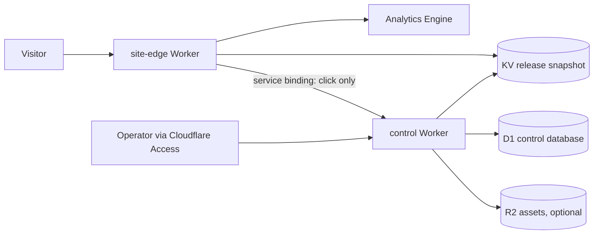

# Architecture

## Decision

DomainMonetizer is a Cloudflare-native multi-tenant application. A domain is configuration and an immutable release, never a separately deployed site.

Portfolio apex domains are added as individual full Cloudflare zones and connected to the same `site-edge` Worker as custom domains. This avoids the CNAME-at-apex limitation of the standard Cloudflare for SaaS path without paying for Enterprise apex proxying. The operating model is still one application: additional zones add routing configuration, not deployments or per-domain code.

The public Worker has no D1, Cloudflare API, provider, or admin credentials. The control Worker is the sole writer and is unavailable to the public except for narrowly authenticated internal endpoints and future signed provider postbacks.

Shared liveness and tenant readiness are deliberately separate. `/healthz` proves the Worker runtime is responding; `/readyz` additionally resolves the request hostname through the active KV pointer and validates the release snapshot. Tenant readiness is `200` only for a live release and `503` for a missing, malformed, unavailable, or paused tenant. Neither probe records a visitor event. An authenticated control-plane readiness request writes a separate `health_canary` Analytics Engine event; it has no visitor identifier and is excluded from every traffic query.

During the pilot, the control Worker calls every published tenant's `/readyz` four times daily and stores the source, HTTP result, latency, expected release, observed release, and bounded error in D1. Scheduled and manual checks are distinct, and `(domain_id, checked_at)` is idempotent. A tenant counts as currently ready only when the end-to-end hostname returns the exact active release within the last eight hours. At scale review it must also have at least 95% of expected scheduled checks and at least 95% ready scheduled checks during the clean completed-day window. This catches DNS, TLS, route, KV, stale-release, monitor-gap, and sustained-availability failures without contaminating natural-traffic data, while tolerating one or two transient failures over 14 days. Each invocation is capped at 20 tenants, safely below the Workers Free subrequest limit; this is intentionally a pilot monitor, not the thousands-domain implementation. Scaling requires a queued or cursor-batched checker before domain 21 is published.

Each scheduled readiness request carries a deterministic health-check ID and an HMAC-SHA-256 signature; the shared secret itself is never sent over the public hostname. The edge verifies the signature in constant time, writes that ID into Analytics Engine as a canary, and D1 stores the same ID with the readiness result. A retry of the same scheduled invocation therefore remains idempotent. The completed-day rollup compares scheduled D1 checks with distinct Analytics Engine canaries for every published tenant. Missing, extra, or sampled canaries make the day unverified. This distinguishes a genuinely quiet natural-traffic day from a broken ingestion pipeline without creating synthetic views or sessions.

## Publication model

1. Validate structured content with the shared schema.
2. Compile a complete release snapshot, including HTML.
3. Insert the immutable release into D1.
4. Write `release:{release_id}` to KV.
5. Atomically switch `site:{hostname}:active` to the release ID.
6. Record the deployment and audit event.

Rollback only changes the active pointer to an earlier immutable release. Pausing changes the pointer to an explicit paused snapshot; a missing or malformed snapshot fails closed.

## Security boundaries

- Admin access requires a valid Cloudflare Access JWT whose email exactly matches the configured operator.
- A separate rotatable operator bearer token can authenticate scripted imports and publication. It is stored only as a Worker secret, is never accepted by the public Worker, and is independent of the edge/control shared secret.
- Codex jobs use a third, independent runner secret. The local runner invokes `codex exec` ephemerally in a read-only sandbox, constrains output with JSON Schema, and submits drafts back through server-side validation; generated content is never auto-approved or auto-published.
- Internal site-edge/control calls use a service binding plus a constant-time shared-secret check.
- Content is structured JSON; AI cannot supply arbitrary HTML, scripts, URLs, or headers.
- Outbound URLs are never accepted from the browser. The control plane resolves an active offer from server-side policy.
- Audit records accompany every mutation.
- No raw IP addresses are retained. Visitor identifiers are short-lived, first-party random IDs and may be stored only as a one-way hash.

## Measurement and scale gate

The first launch and visual-QA burst is not decision data. `TELEMETRY_MIN_DATE` establishes a clean UTC boundary; earlier Analytics Engine events are retained by Cloudflare but skipped by the D1 rollup. Preview-host traffic is also excluded even though a preview snapshot retains the source domain ID.

Telemetry v2 records no raw IP address. A 30-minute first-party random ID is hashed with a Worker secret before it reaches Analytics Engine. Engagement is recorded only when the beacon is exact same-origin and carries that issued session cookie; missing-session beacons are ignored and cross-origin posts are rejected. The edge also records country, ASN organization, a conservative visitor class and the reason for that class. Browser-shaped traffic without a real navigation or interaction signal remains `unknown`; verified automation, low Bot Management scores when available, and automation user agents are `bot`. Cloudflare Bot Management is optional and is not required for the current free-plan implementation.

Tenant HTML is deliberately `no-store`, and caching is disabled for the public Worker entrypoint during the traffic pilot. View measurement happens inside the Worker, so a browser or edge HTML cache would otherwise suppress requests before telemetry runs. Static images, styles, scripts, robots, sitemaps, and canonical redirects retain explicit client cache policies. If the portfolio later needs cached HTML, view collection and cache behavior must be redesigned together and revalidated before enabling it.

Each completed UTC day is rolled into D1 with sampling-aware Analytics Engine SQL. Weighted event totals use `_sample_interval`; the rollup separately records the maximum interval across all queries and the interval seen by the distinct-session query. Distinct anonymous-session counts cannot be reconstructed exactly after sampling, so session-query sampling blocks `review_ready` instead of presenting an undercount as exact evidence. Country and source queries may be read-time sampled even while sessions remain exact; their weighted results stay visible as explicitly sampling-adjusted estimates and do not falsely block the exact session gate. The control plane stores all views, likely-human views, bot and unknown views, anonymous qualified sessions, human engagement, US likely-human views, clicks, country summaries, source-quality summaries, and the outcome of every rollup run. Source quality groups only visitor class, classification reason, country, ASN, ASN organization, views, and engagements; it contains no visitor identifier. This lets the scale review distinguish consumer-network traffic from browser-spoofing requests on hosting, cloud, or research networks after the raw Analytics Engine window expires.

The scheduled rollup is self-healing. It compares successful runs with the actual latest completed UTC day and replays up to five oldest missing days per invocation. The operator API and the rollup core both reject the current or any future UTC date, so a partial day can never be marked successful or satisfy coverage. A rerun resets the date's prior traffic fields and replaces its country and source-quality rows before applying the fresh result, so an empty or corrected Analytics query cannot leave stale evidence behind. Conversion and revenue columns remain independent for the later economic ledger.

The admin exposes an evidence status, not an automatic expansion command. Complete rollup coverage, a verified telemetry canary for every completed tenant-day, an unsampled distinct-session query, fresh exact-release readiness, and at least 95% scheduled health coverage/readiness for every published pilot tenant are hard prerequisites:

- `collecting`: fewer than 14 complete clean UTC days;
- `insufficient_signal`: at least 14 days but fewer than 10 qualified anonymous sessions across the pilot;
- `review_ready`: enough traffic evidence for the operator to review quality, geo fit, and system reliability.

`review_ready` can justify discussing a larger traffic pilot. It does not prove monetization economics; that requires the later Marketcall conversion and payout ledger.

Cloudflare Access is the interactive-admin boundary. The Zero Trust Free organization protects the browser session; operational API calls require both an Access service token and the separate operator bearer secret. Neither credential is exposed to the public Worker or reused as the edge/control secret.

## Frontend design thesis

The admin is a quiet control room: warm off-white surfaces, graphite typography, one electric-cobalt action color, dense operational tables, and a single side inspector instead of a dashboard full of cards.

The initial public template is an independent local-service guide: editorial home/craft imagery, warm stone colors, one amber call-to-action, strong service hierarchy, and a visible independent-referral disclosure. The page has one primary action and no fake reviews, fake local office, or impersonation cues.
