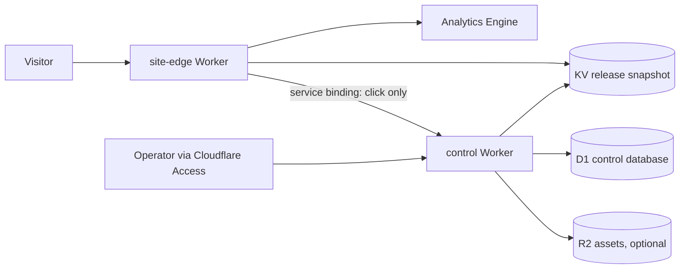

# Architecture

## Decision

DomainMonetizer is a Cloudflare-native multi-tenant application. A domain is configuration and an immutable release, never a separately deployed site.

Portfolio apex domains are added as individual full Cloudflare zones and connected to the same `site-edge` Worker as custom domains. DomainMonetizer stores each zone ID, the exact Cloudflare-assigned nameserver pair, and the last verification timestamp on the domain row; the Cloudflare API remains authoritative and metadata is updated only after an exact live readback. This avoids the CNAME-at-apex limitation of the standard Cloudflare for SaaS path without paying for Enterprise apex proxying. The operating model is still one application: additional zones add routing configuration, not deployments or per-domain code.

That topology has a deliberate scale boundary. Cloudflare currently allows one Worker to be routed to at most 1,000 zones, so the current Worker must not approach that ceiling without a new routing decision. Keep at least 10% route headroom. The recommended path is:

1. Keep individual full zones for the pilot and the first evidence-backed expansion. This is the cheapest and simplest apex-domain topology while the portfolio is well below the route ceiling.
2. Before 900 routed zones, run a same-account canary migration to standard Cloudflare for SaaS using a Cloudflare-hosted apex CNAME, which is flattened automatically. Verify hostname and certificate activation, request routing, telemetry, rollback, and monthly billing with one non-pilot domain.
3. If that canary succeeds and measured domain economics comfortably absorb the hostname fee, use Cloudflare for SaaS as the preferred multi-thousand-domain routing plane. If the fee is uneconomic, the fallback is identical Worker shards with deterministic zone ownership, coordinated releases, and cross-shard health reporting; this is cheaper but operationally riskier.

Cloudflare for SaaS currently includes 100 custom hostnames, supports up to 50,000 on non-Enterprise plans, and charges `$0.10` per additional hostname per month. Neither migration path is authorized by a traffic-only `review_ready` result: projected economics, an exact batch size, a current limit/cost audit, and explicit user approval are required first.

The public Worker has no D1, Cloudflare API, provider, or admin credentials. The control Worker is the sole writer and is unavailable to the public except for narrowly authenticated internal endpoints and future signed provider postbacks.

Shared liveness and tenant readiness are deliberately separate. `/healthz` proves the Worker runtime is responding; `/readyz` additionally resolves the request hostname through the active KV pointer and validates the release snapshot. Tenant readiness is `200` only for a live release and `503` for a missing, malformed, unavailable, or paused tenant. Neither probe records a visitor event. An authenticated control-plane readiness request writes a separate `health_canary` Analytics Engine event; it has no visitor identifier and is excluded from every traffic query.

During the pilot, the control Worker calls every published tenant's `/readyz` four times daily and stores the source, HTTP result, latency, expected release, observed release, and bounded error in D1. Scheduled and manual checks are distinct, and `(domain_id, checked_at)` is idempotent. A tenant counts as currently ready only when the end-to-end hostname returns the exact active release within the last eight hours. At scale review it must also have at least 95% of expected scheduled checks and at least 95% ready scheduled checks during the clean completed-day window. This catches DNS, TLS, route, KV, stale-release, monitor-gap, and sustained-availability failures without contaminating natural-traffic data, while tolerating one or two transient failures over 14 days. Each invocation is capped at 20 tenants, safely below the Workers Free subrequest limit; this is intentionally a pilot monitor, not the thousands-domain implementation. Scaling requires a queued or cursor-batched checker before domain 21 is published.

The protected overview also evaluates the in-progress UTC day against the four expected schedule slots. A slot becomes expected at its cron minute and required after a ten-minute grace period. Per-domain missing, duplicate, or non-ready scheduled checks fail the deterministic pilot audit immediately instead of remaining invisible until the next completed-day rollup.

Each scheduled readiness request carries a deterministic health-check ID and an HMAC-SHA-256 signature; the shared secret itself is never sent over the public hostname. The edge verifies the signature in constant time, writes that ID into Analytics Engine as a canary, and D1 stores the same ID with the readiness result. A retry of the same scheduled invocation therefore remains idempotent. The completed-day rollup compares scheduled D1 checks with distinct Analytics Engine canaries for every published tenant. Missing, extra, or sampled canaries make the day unverified. This distinguishes a genuinely quiet natural-traffic day from a broken ingestion pipeline without creating synthetic views or sessions.

## Publication model

1. Validate structured content with the shared schema.
2. Compile a complete release snapshot, including HTML.
3. Insert the immutable release into D1.
4. Write `release:{release_id}` to KV.
5. Atomically switch `site:{hostname}:active` to the release ID.
6. Record the deployment and audit event.

Publish, pause, and rollback switch the runtime pointer before committing the corresponding D1 status, deployment, and audit records. If that D1 batch fails, the control plane automatically restores the previous pointer (or removes the first-publication pointer) before returning the error. A failed initial pointer write never mutates D1. This bounded compensation keeps KV runtime truth and D1 control state aligned without introducing a queue or a multi-day workflow. Readiness monitoring remains the backstop for the rare case where both a D1 commit and its pointer compensation fail.

Rollback changes the active pointer to an earlier immutable release. Pausing changes the pointer to an explicit paused snapshot; a missing or malformed snapshot fails closed.

## Security boundaries

- Admin access requires a valid Cloudflare Access JWT whose email exactly matches the configured operator.
- A separate rotatable operator bearer token can authenticate scripted imports and publication. It is stored only as a Worker secret, is never accepted by the public Worker, and is independent of the edge/control shared secret.
- Codex jobs use a third, independent runner secret. The local runner invokes `codex exec` ephemerally in a read-only sandbox, constrains output with JSON Schema, and submits drafts back through server-side validation; generated content is never auto-approved or auto-published.
- Internal site-edge/control calls use a service binding plus a constant-time shared-secret check.
- Content is structured JSON; AI cannot supply arbitrary HTML, scripts, URLs, or headers.
- The displayed site identity is not an AI or import field. The renderer deterministically uses `{city} {vertical} Guide`, so former-business names cannot be reintroduced through generated content.
- Outbound URLs are never accepted from the browser. The control plane resolves an active offer from server-side policy.
- Audit records accompany every mutation.
- No raw IP addresses are retained. Visitor identifiers are short-lived, first-party random IDs and may be stored only as a one-way hash.

## Measurement and scale gate

The first launch and visual-QA burst is not decision data. `TELEMETRY_MIN_DATE` establishes a clean UTC boundary; earlier Analytics Engine events are retained by Cloudflare but skipped by the D1 rollup. Preview-host traffic is also excluded even though a preview snapshot retains the source domain ID.

Telemetry records no raw IP address. Before creating visitor telemetry, the edge hashes the request's Cloudflare-provided source IP in memory with a dedicated secret salt and compares it with the secret operator-exclusion hashes. A match receives no visitor cookie and creates no view, engagement, or Analytics Engine click event; neither the raw source IP nor its exclusion hash is written to analytics. A renewable 30-minute first-party random ID is hashed with a separate Worker secret before it reaches Analytics Engine. A second HttpOnly cookie contains only the current UTC day and a server signature; it expires at the day boundary and prevents duplicate qualified-session points without storing a visitor identifier in D1. Engagement is recorded only when the beacon is exact same-origin and carries the issued session cookie; missing-session beacons are ignored and cross-origin posts are rejected. The edge also records country, ASN organization, a conservative visitor class and the reason for that class. Browser-shaped traffic without a real navigation or interaction signal remains `unknown`; verified automation, low Bot Management scores when available, and automation user agents are `bot`. Cloudflare Bot Management is optional and is not required for the current free-plan implementation.

Geographic and timing context is deliberately coarse. For US requests the edge retains only the two-letter state code, plus a four-hour bucket calculated in the visitor's inferred local timezone. The daily rollup aggregates those two dimensions and discards invalid values. City, ZIP, coordinates, exact local hour, raw timezone, and IP address are not stored. This is sufficient to evaluate state eligibility and likely calling-hour fit without collecting precise location.

Residual links often target paths left by a domain's prior site, not just `/`. Safe legacy paths therefore render the same independent, canonicalized `noindex` guide instead of discarding the visit as a 404. Known scanner and sensitive paths such as login panels, executable files, environment files, and repository metadata still fail closed without telemetry. Analytics stores only bounded path-intent, device, and referrer classes; raw paths, query strings, and referrer URLs are never retained. This preserves useful demand evidence without recreating or impersonating the former business.

Tenant HTML is deliberately `no-store`, and caching is disabled for the public Worker entrypoint during the traffic pilot. View measurement happens inside the Worker, so a browser or edge HTML cache would otherwise suppress requests before telemetry runs. Static images, styles, scripts, robots, sitemaps, and canonical redirects retain explicit client cache policies. If the portfolio later needs cached HTML, view collection and cache behavior must be redesigned together and revalidated before enabling it.

Each completed UTC day is rolled into D1 with sampling-aware Analytics Engine SQL. Weighted event totals use `_sample_interval`; the rollup separately records the maximum interval across all queries and the maximum interval seen by the qualified-session query. General traffic remains indexed by tenant for weighted quality analysis. Once a browser is classified as human by a navigation or verified same-origin interaction, the v3 stream emits one minimal `qualified_session_v3` point per hostname and UTC day. Its `qualified_v3:<domain-id>` index is dedicated to the low-volume qualified stream, while hostname, domain ID, release ID, and country are the only bounded blobs. One grouped query is restricted to the published qualified-index allowlist and produces all-country and U.S. totals from the bounded domain blob. This isolates session evidence from a tenant's high-volume sampled view index and avoids v2's unsupported high-cardinality pattern of using a unique browser hash as every row's index. Sampling still rejects a day from decision-grade evidence rather than presenting an undercount as exact. Country and source queries may be sampled while sessions remain exact; their weighted results stay visible as explicitly sampling-adjusted estimates. The control plane stores all views, likely-human views, bot and unknown views, anonymous qualified sessions, human engagement, US likely-human views, clicks, country summaries, source-quality summaries, coarse entry-intent summaries, state/time summaries, and the outcome of every rollup run. Source quality groups only visitor class, classification reason, country, ASN, ASN organization, views, and engagements; entry intent groups only bounded path, device, and referrer classes; context groups only state and four-hour local-time bucket. D1 contains no visitor identifier. This lets the scale review distinguish consumer-network traffic from browser-spoofing requests and evaluate intent, state fit, and likely service hours after the raw Analytics Engine window expires.

The scheduled rollup is self-healing. It compares successful runs with the actual latest completed UTC day and replays up to five oldest missing days per invocation. The operator API and the rollup core both reject the current or any future UTC date, so a partial day can never be marked successful or satisfy coverage. A rerun resets the date's prior traffic fields and replaces its country and source-quality rows before applying the fresh result, so an empty or corrected Analytics query cannot leave stale evidence behind. Conversion and revenue columns remain independent for the later economic ledger.

The admin exposes an evidence status, not an automatic expansion command. The retained traffic boundary remains `2026-08-05`; failed or sampled days remain visible and are never rewritten as good evidence. `EXACT_SESSION_MIN_DATE` marks the first full UTC day produced entirely by the current exact-session stream (`2026-08-10` for v3). A review requires at least 14 decision-grade days on or after that date, where the same day has complete rollup coverage, verified telemetry canaries, and an unsampled exact-session query. Fresh exact-release readiness and at least 95% scheduled health coverage/readiness for every published pilot tenant remain hard prerequisites. A transient bad day delays the review instead of permanently poisoning every later day:

- `collecting`: fewer than 14 complete decision-grade UTC days;
- `insufficient_signal`: at least 14 days but fewer than 10 qualified anonymous sessions across the pilot;
- `review_ready`: enough traffic evidence for the operator to review quality, geo fit, and system reliability.

`review_ready` can justify discussing a larger traffic pilot. It does not prove monetization economics; that requires the later Marketcall conversion and payout ledger.

During the natural-traffic pilot, the protected overview also reports active offers, active routing policies, clicks, conversions, and postbacks. The evidence gate and deterministic operator audit require all five counts to remain zero, and the admin shows the state beside live readiness. This makes the measurement-only state an observable invariant rather than an assumption; enabling any monetization component deliberately blocks review and fails the pilot audit until the later Marketcall phase updates the operating contract.

Cloudflare Access is the interactive-admin boundary. The Zero Trust Free organization protects the browser session; operational API calls require both an Access service token and the separate operator bearer secret. Neither credential is exposed to the public Worker or reused as the edge/control secret.

## Frontend design thesis

The admin is a quiet control room: warm off-white surfaces, graphite typography, one electric-cobalt action color, dense operational tables, and a single side inspector instead of a dashboard full of cards. Portfolio is the primary working surface. Jobs is a read-only ledger for the constrained content runner, and Audit exposes authenticated control-plane mutations without returning stored before/after payloads. Publish, pause, and rollback require an explicit browser confirmation because they change the live runtime; checks, previews, and draft generation do not.

The initial public template is an independent local-service guide: editorial home/craft imagery, warm stone colors, one amber call-to-action, strong service hierarchy, and a visible independent-referral disclosure. The page has one primary action and no fake reviews, fake local office, or impersonation cues.
