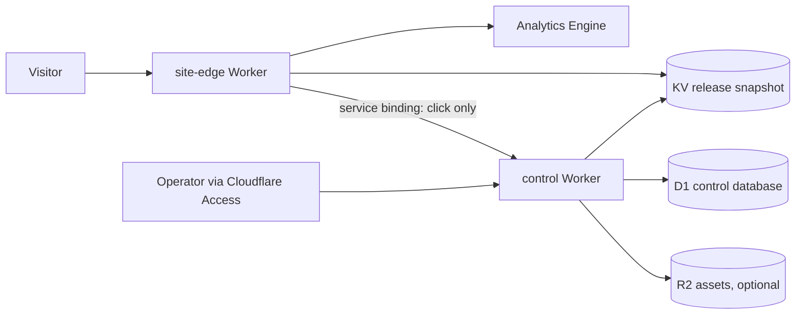

# Architecture

## Decision

DomainMonetizer is a Cloudflare-native multi-tenant application. A domain is configuration and an immutable release, never a separately deployed site.

Portfolio apex domains are added as individual full Cloudflare zones and connected to the same `site-edge` Worker as custom domains. This avoids the CNAME-at-apex limitation of the standard Cloudflare for SaaS path without paying for Enterprise apex proxying. The operating model is still one application: additional zones add routing configuration, not deployments or per-domain code.

The public Worker has no D1, Cloudflare API, provider, or admin credentials. The control Worker is the sole writer and is unavailable to the public except for narrowly authenticated internal endpoints and future signed provider postbacks.

## Publication model

1. Validate structured content with the shared schema.
2. Compile a complete release snapshot, including HTML.
3. Insert the immutable release into D1.
4. Write `release:{release_id}` to KV.
5. Atomically switch `site:{hostname}:active` to the release ID.
6. Record the deployment and audit event.

Rollback only changes the active pointer to an earlier immutable release. Pausing changes the pointer to an explicit paused snapshot; a missing or malformed snapshot fails closed.

## Security boundaries

- Admin access requires a valid Cloudflare Access JWT whose email exactly matches the configured operator.
- A separate rotatable operator bearer token can authenticate scripted imports and publication. It is stored only as a Worker secret, is never accepted by the public Worker, and is independent of the edge/control shared secret.
- Codex jobs use a third, independent runner secret. The local runner invokes `codex exec` ephemerally in a read-only sandbox, constrains output with JSON Schema, and submits drafts back through server-side validation; generated content is never auto-approved or auto-published.
- Internal site-edge/control calls use a service binding plus a constant-time shared-secret check.
- Content is structured JSON; AI cannot supply arbitrary HTML, scripts, URLs, or headers.
- Outbound URLs are never accepted from the browser. The control plane resolves an active offer from server-side policy.
- Audit records accompany every mutation.
- No raw IP addresses are retained. Visitor identifiers are short-lived, first-party random IDs and may be stored only as a one-way hash.

Cloudflare Access is the intended interactive-admin boundary. Until the account's Zero Trust Free checkout is completed, the UI fails closed and operational API calls use the separate bearer secret. That temporary path does not expose the control Worker or reuse the public edge secret.

## Frontend design thesis

The admin is a quiet control room: warm off-white surfaces, graphite typography, one electric-cobalt action color, dense operational tables, and a single side inspector instead of a dashboard full of cards.

The initial public template is an independent local-service guide: editorial home/craft imagery, warm stone colors, one amber call-to-action, strong service hierarchy, and a visible independent-referral disclosure. The page has one primary action and no fake reviews, fake local office, or impersonation cues.
